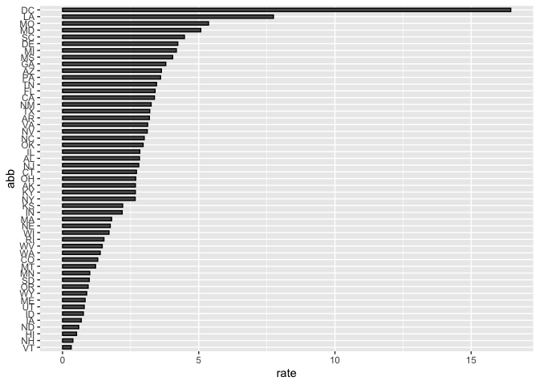

Report on Gun Murders
================
Shreya Lahiri
04/05/2020

## R Markdown

This is a report on 2010 gun murder rates obtained from FBI Reports. The
original data was obtained from
(<https://en.wikipedia.org/wiki/Murder_in_the_United_States_by_state>).

We are going to use the following library:

``` r
library(tidyverse)
```

and load the data we already wrangled:

``` r
load("rda/murders.rda")
```

## Murder rate by state

We note the large state to state variability by generating a bar plot
showing the murder rate by state:

<!-- -->
